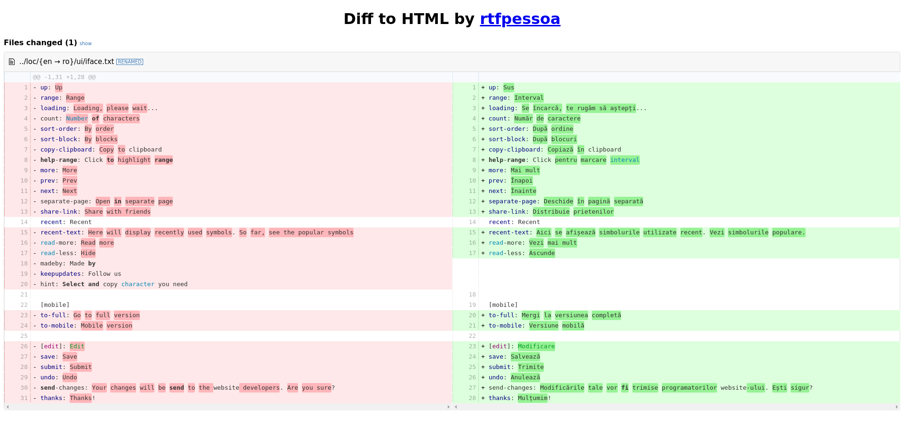

# Tools

This directory offers tools to help analyse the translations.

## Overview

An overview of the amount of directories, files and lines per language in
`../loc/` can be generated by running

    ./generate-overview.sh

It will create a MarkDown file called [`overview.md`](overview.md) which
will list these details per language, starting with English at the top.

## Translation review

Differences between a file for English and a file for another language is the
actual translation. By generating static HTML files showing these differences
side by side, it is easy to do a review of a translation.

The script `review-translations.sh` reports these differences between the
original text in English and the translated text. The output is in HTML
where the differences, i.e. the actual translation or lack thereof, can be
reviewed.

First, install [diff2html](https://www.npmjs.com/package/diff2html) with

    sudo apt-get install npm
    sudo npm install -g diff2html-cli

Then run for the language code you would like to review

    ./review-translations.sh lang_code

This script takes a while to run. Running it without a language code will
result in a review of all languages and this takes hours!

After changing a translation, the script can easily be rerun for that language.
The results, in form of HTML files, can be found in the directory
[`reviews`](reviews).

An example of such review report is seen below.

## Identical source texts

Some of the source text in English for files in `../loc/en/symbols` is
identical for certain Unicode points. This is not a problem, but good to be
aware of. A short overview of these can be created by running

    ./identical-source-texts.sh
